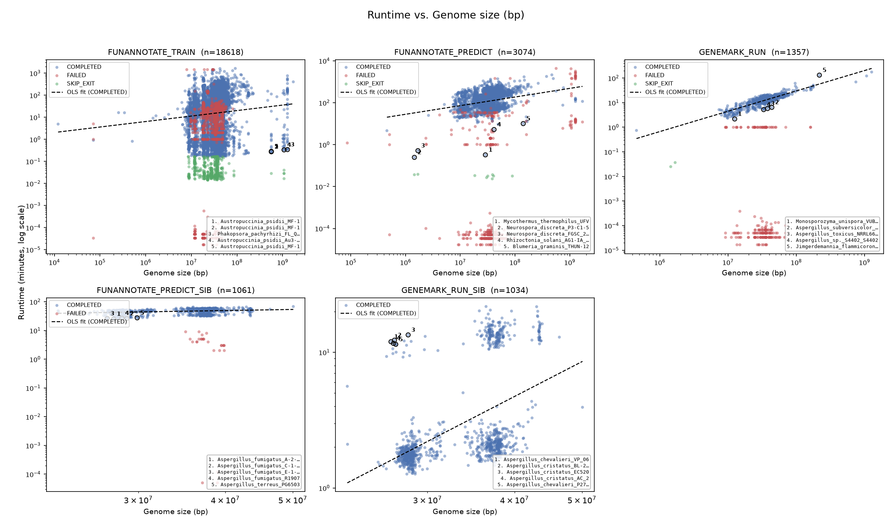
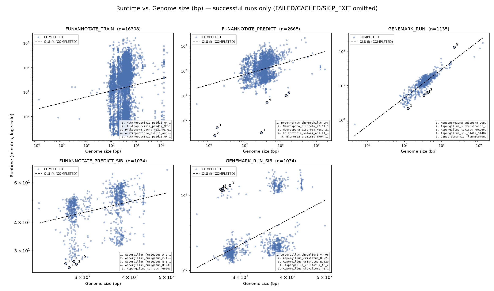
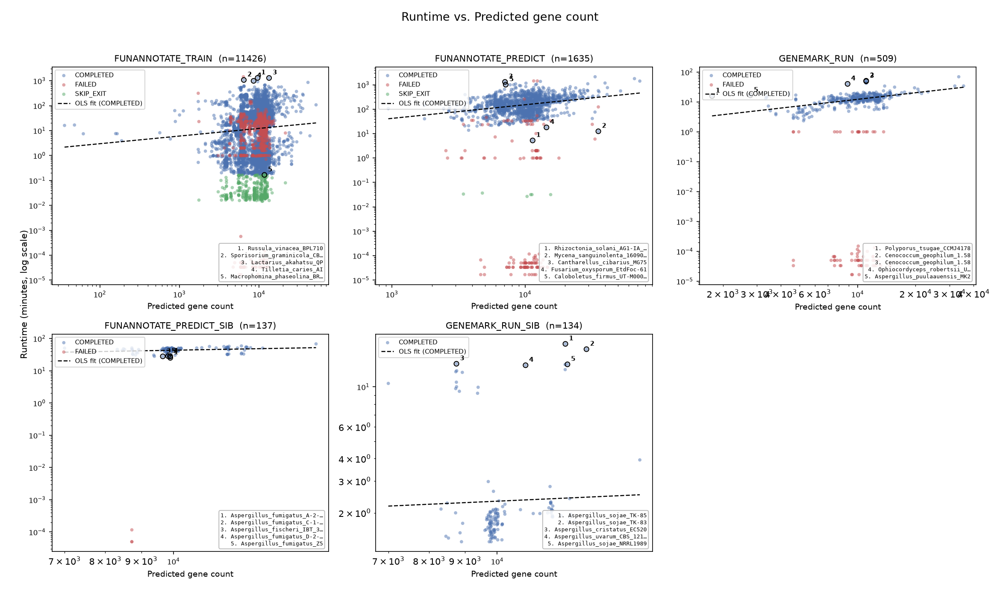
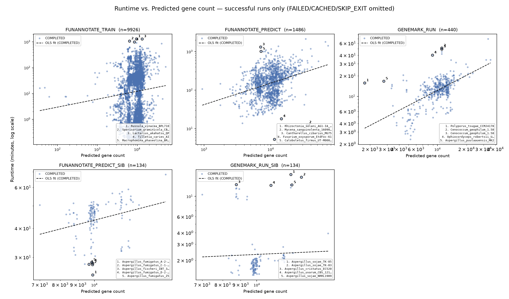
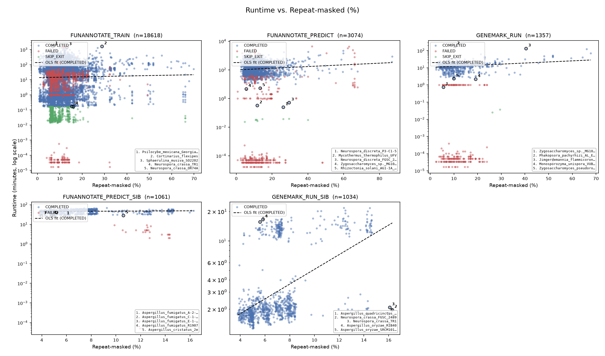
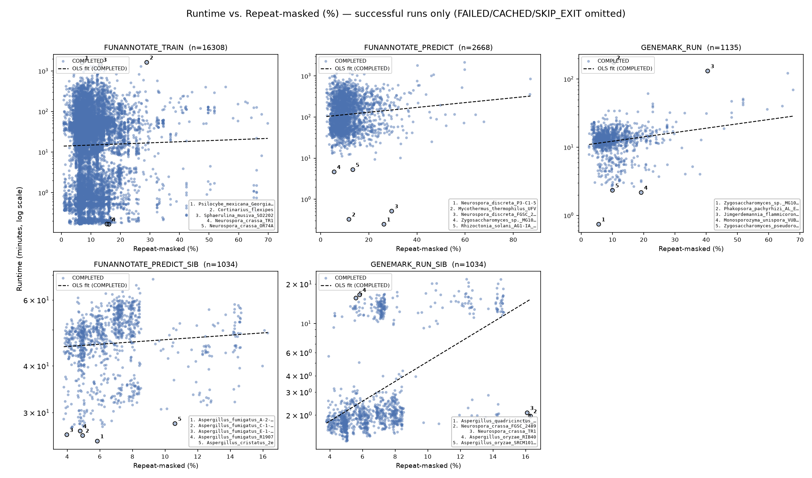
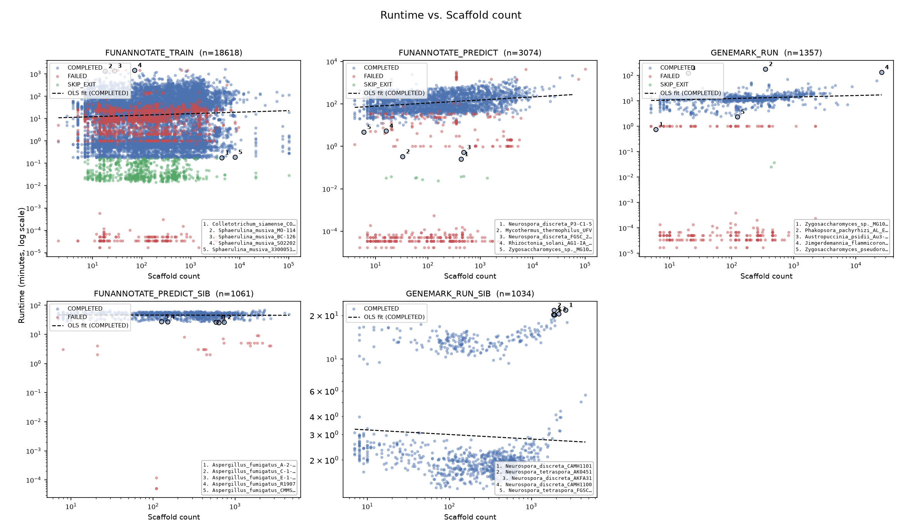
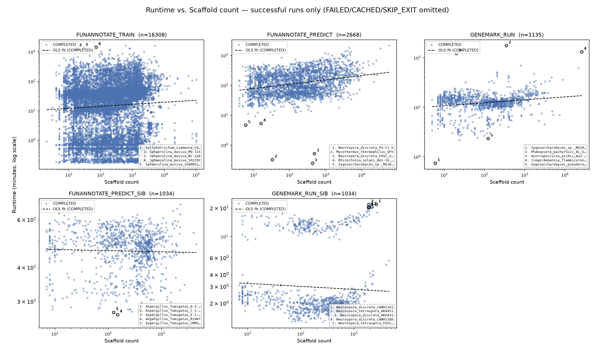

# funannotate runtime scaling vs. genome size / gene count / repeat content

## Purpose

For a comprehensive funannotate benchmarking paper: characterize how per-task wall-clock
runtime scales with assembly size, predicted gene count, repeat content, and scaffold
count, across the full history of pipeline runs in `Fungi_BFD_runs` (not just the current
run) — and surface outliers worth explaining rather than averaging away. Failed/aborted
attempts are kept in the dataset rather than filtered out; for a benchmarking paper they
are part of the record (failure modes, retry cost), not noise.

## Status

**Status**: active

## Datasets

- `Fungi_BFD_runs/{do_annotation,do_annotation_asco,do_annotation_Rhod}/logs/nextflow/funannotate_trace*.txt`
  — 181 Nextflow `-with-trace` files, the source of every runtime/status/exit observation.
- `Fungi_BFD_runs/results/genome_stats_by_name/<Genus>/<species>.asm_stats.stats.txt` —
  shared assembly-stats DB (genome size, scaffold count, GC%, N50, repeat-masked %),
  symlinked identically into all three pipeline roots.
- `Fungi_BFD_runs/results/genome_stats_by_name/<Genus>/<species>.gene_stats.gene_info.csv.gz`
  — one row per predicted gene; used as a gene-count proxy (line count − header).
- Fallback only (used when a species has no asm_stats entry, ~0.7% of joined rows):
  `work/<subdir>/<hash>/.command.log`, parsed for funannotate's own
  `Genome loaded: N scaffolds; M bp; P% repeats masked` banner line.

Built by `Fungi_BFD_runs/do_annotation_asco/scripts/build_runtime_metadata_table.py` into
`Fungi_BFD_runs/analysis/funannotate_runtime_metadata.parquet` — **59,965 task-attempt
rows**, one per distinct Nextflow task hash (a real retry/rerun is a distinct hash, so the
table is observations, not a per-assembly summary). Designed to be re-run and merged as
more trace files accumulate.

## Algorithms

- `build_runtime_metadata_table.py` — trace parsing, hash-based dedup, species-keyed join
  against the two DBs above. Also flags `likely_skip_exit` (COMPLETED, realtime < 10s, on
  a funannotate-family process) — see Key Findings.
- `plot_runtime_relationships.py` — per-process small-multiples scatter (log-log for
  size/gene-count/scaffolds, linear-x for repeat %), OLS fit line per facet over
  `COMPLETED`, non-skip-exit points only, top-5-by-|residual| outliers numbered on-plot
  with a species-name key box (avoids the label-collision mess a first pass had with
  inline per-point text). Writes two variants per metric: the full scatter (FAILED/
  CACHED/SKIP_EXIT shown in distinct colors) and a `*_success_only` variant that omits
  everything but genuine COMPLETED runs, for "how long does a real run take" reading.

## Parent Analysis

Not a direct parent, but directly relevant prior work in this repo:
- `analysis/funannotate_predict_stage_timing/` — found that Augustus's BUSCO-vs-PASA
  training path (dependent on RNA-seq evidence availability, not genome size) dominates
  PREDICT wall time in 67% of sampled runs. That is consistent with what this analysis
  finds independently below (genome size is a weak predictor of PREDICT/TRAIN runtime).
- `analysis/funannotate_train_stage_timing/` — same method, TRAIN side.

## Key Findings

**Coverage.** The asm_stats DB join matched 8,296/22,955 distinct species (36% of all
species appearing anywhere in the trace history); restricted to species with at least one
`FUNANNOTATE_PREDICT` observation, coverage is 2,810/3,764 (75%). Gene counts matched far
fewer distinct species (2,661/22,955) since the gene_stats DB only covers species with a
completed, retained annotation. Genome-stats coverage by process (of all attempts, not
just distinct species):

| process | attempts | with genome stats | coverage |
|---|---|---|---|
| GENEMARK_RUN_SIB | 1,129 | 1,054 | 93.4% |
| FUNANNOTATE_PREDICT_SIB | 1,162 | 1,087 | 93.5% |
| FUNANNOTATE_PREDICT | 4,660 | 3,530 | 75.8% |
| FUNANNOTATE_TRAIN | 31,130 | 21,698 | 69.7% |
| GENEMARK_RUN | 1,989 | 1,364 | 68.6% |
| RNASEQ_PREPARE | 1,193 | 56 | 4.7% |

RNASEQ_PREPARE's low coverage is a real data-shape limit, not a lookup bug: most of its
trace rows are tagged with SRA accessions or read-batch identifiers rather than clean
species names, so the genus/species-keyed join mostly can't apply to it.

**GENEMARK_RUN is the one process where genome size is a strong, near-linear predictor of
runtime.** Log-log OLS over COMPLETED, non-skip-exit attempts: **R² = 0.772, slope = 0.83**
(genome size in bp vs. runtime in minutes) — consistent with GeneMark-ES's per-base HMM
scan cost. GENEMARK_RUN_SIB shows a much weaker, noisier relationship (R² = 0.225) but its
genome-size range in this dataset is narrow (25–50 Mb), so that slope estimate (2.65) is
not reliable.

**FUNANNOTATE_TRAIN and FUNANNOTATE_PREDICT runtime is only weakly explained by genome
size, gene count, repeat %, or scaffold count individually** (R² between 0.0003 and 0.10
across all four metrics, for both processes — the single highest being PREDICT vs. gene
count at R²=0.101). This corroborates
`funannotate_predict_stage_timing`'s finding from a completely different method
(log-timestamp stage attribution): PREDICT/TRAIN wall time is dominated by
evidence-availability branching (RNA-seq presence → PASA vs. BUSCO Augustus training path;
the BUSCO path alone was measured there at median 25.9 min, p90 61.2 min) rather than by
assembly size.

Full R²/slope table per process × metric is in `outputs/fit_summary.csv`.

**A quick-fail cluster exists at ~milliseconds of runtime for FAILED tasks, across every
process and every genome-size range** (visible as a horizontal band pinned to the bottom
of every genome-size and gene-count plot, ~10⁻⁴–10⁻⁵ minutes). These are not slow crashes —
they are essentially-instant failures (SLURM submission problems, missing inputs,
environment/container errors) unrelated to assembly size. Worth a dedicated audit of
`exit_code`/`status` on that subset if failure-mode characterization is wanted for the
paper; not investigated further here.

**Outlier pattern, now explained**: every one of the 100 flagged per-facet outliers
(`outputs/runtime_outliers.csv`) is a `FUNANNOTATE_PREDICT` attempt with
`status=COMPLETED, exit=0`, genuine (large) genome/gene-count metadata, but a runtime of
only **~1.4–2.2 seconds** — orders of magnitude below the ~50–200 minutes the fit predicts
for assemblies of that size. Examples: `Basidiobolus_meristosporus_CBS_931.73`,
`Phlebopus_portentosus_PP33`, `Aspergillus_parasiticus_GA10_9_ap28`,
`Cladobotryum_mycophilum_ATHUM6906`, `Lyophyllum_shimeji_AT787`. The Nextflow work
directories for these hashes were already cleaned up, so this could not be verified
directly from a `.command.log`, but per project-owner confirmation: funannotate checks for
existing output files in the target predict_results folder before running and exits
immediately if they're already present. That produces exactly this signature — a fresh
Nextflow task hash (so it isn't logged as `CACHED` at the Nextflow level) that exits
almost instantly with `exit 0` because funannotate's own internal idempotency check, not
Nextflow's, short-circuited the work. **Implication for this table**: these rows are not
real PREDICT executions and should be excluded (e.g. filter `realtime_s` below some
floor, a few seconds, for this process) from any runtime distribution or fit meant to
characterize actual PREDICT cost — they're a distinct "skip" outcome, not a fast
prediction.

## Open Questions

- The ~2-second `COMPLETED` PREDICT rows are confirmed skip-exits (funannotate's own
  existing-output check), not real executions. This table doesn't yet mark them as such
  distinctly from a genuinely fast real run — worth adding an explicit flag (e.g. a
  `realtime_s` floor, or detecting the skip message directly when a work dir is still
  live) to `build_runtime_metadata_table.py` so downstream fits/plots can exclude them
  without an ad hoc cutoff each time.
- Audit the near-instant `FAILED` band by `exit_code` to bucket real failure modes
  (container/env errors vs. missing-input vs. something else) for the benchmarking paper's
  failure-mode section.
- RNASEQ_PREPARE's species-name tagging is inconsistent enough that genome-stats joins
  mostly fail for it; if RNASEQ_PREPARE runtime-vs-size is wanted, the join key needs to
  be reworked (e.g. via the SRA accession → species mapping rather than the trace `tag`
  field).
- Consider re-running `build_runtime_metadata_table.py` periodically (it merges by hash
  into the existing parquet) so future PREDICT/TRAIN attempts get genome-stats coverage
  from a *live* work dir before it's cleaned up, closing part of the coverage gap over
  time.

## Reproducibility

To reproduce all outputs:

```bash
cd analysis/funannotate_runtime_scaling
bash run.sh
```

This calls `build_runtime_metadata_table.py` (rebuilds the parquet/CSV table in
`Fungi_BFD_runs/analysis/`) and `plot_runtime_relationships.py` (writes the PNG/PDF plots
and `runtime_outliers.csv`), then copies the outputs here.

## Outputs

| File | Description |
|------|--------------|
| `outputs/runtime_vs_genome_size.png` / `.pdf` | Runtime vs. genome size (bp), faceted by process, all statuses shown |
| `outputs/runtime_vs_genome_size_success_only.png` / `.pdf` | Same, FAILED/CACHED/SKIP_EXIT omitted |
| `outputs/runtime_vs_gene_count.png` / `.pdf` | Runtime vs. predicted gene count, faceted by process |
| `outputs/runtime_vs_gene_count_success_only.png` / `.pdf` | Same, successful runs only |
| `outputs/runtime_vs_repeat_pct.png` / `.pdf` | Runtime vs. repeat-masked %, faceted by process |
| `outputs/runtime_vs_repeat_pct_success_only.png` / `.pdf` | Same, successful runs only |
| `outputs/runtime_vs_num_scaffolds.png` / `.pdf` | Runtime vs. scaffold count, faceted by process |
| `outputs/runtime_vs_num_scaffolds_success_only.png` / `.pdf` | Same, successful runs only |
| `outputs/fit_summary.csv` | Per-process × per-metric OLS R²/slope/intercept (COMPLETED, non-skip-exit only) |
| `outputs/runtime_outliers.csv` | Top-5-by-residual outliers per facet (20 facets × 5), with predicted vs. actual runtime |
| `Fungi_BFD_runs/analysis/funannotate_runtime_metadata.parquet` (+ `.csv`) | The full underlying table, 59,965 rows (kept in the pipeline repo, not duplicated here) |

## Graphs

Each pair below shows the full picture (all statuses, including the FAILED quick-fail
band and the SKIP_EXIT cluster) followed by the successful-runs-only view.

### Runtime vs. genome size




### Runtime vs. predicted gene count




### Runtime vs. repeat-masked %




### Runtime vs. scaffold count



